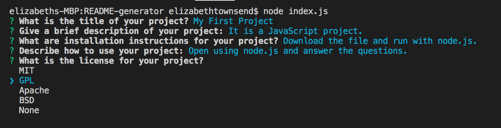
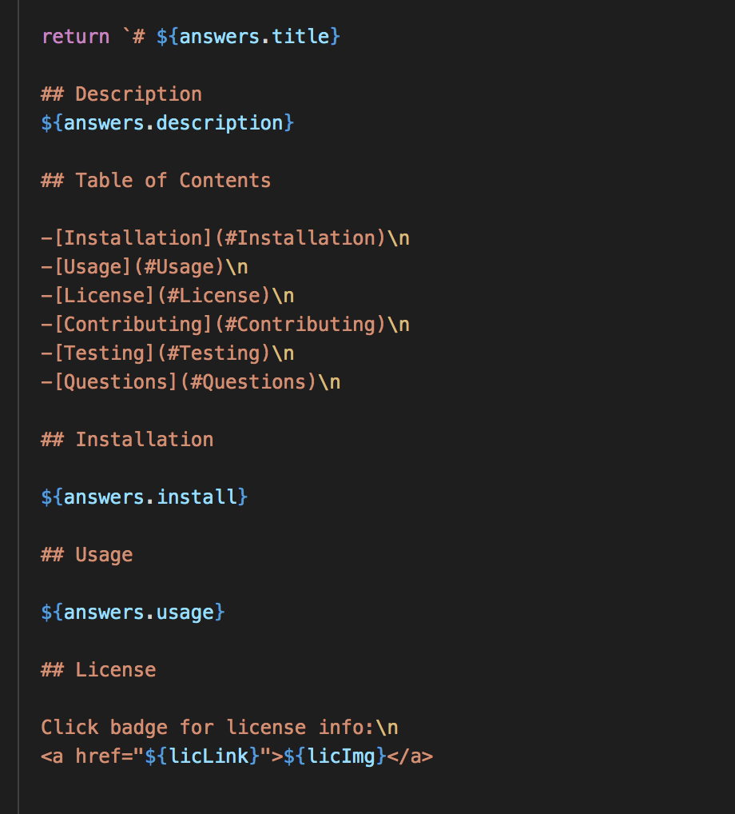

# README-generator

Every good GitHub project deserves a great README file! 

```
AS A developer
I WANT a README generator
SO THAT I can quickly create a professional README for a new project
```

This is a node-based README generator. Once the file is run in node, the user is prompted with a series of command line questions utilizing the <a href="https://www.npmjs.com/package/inquirer?activeTab=readme">inquirer npm</a>, including the title of the project, a short description, etc. with a selection of license options to choose from :



After answering all the questions a markdown file, with the name of the project title, is generated using template literals:




## Usage

Here is a video displaying how to use the program:


<video width="320" height="240" controls>
  <source src="images/READMEGeneratorWalkThrough.mp4" type="video/mp4">
</video>


